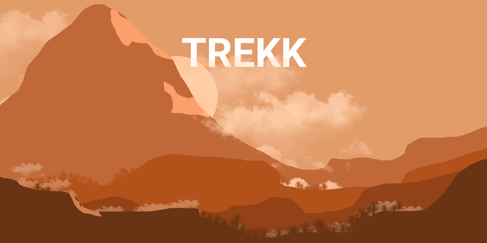
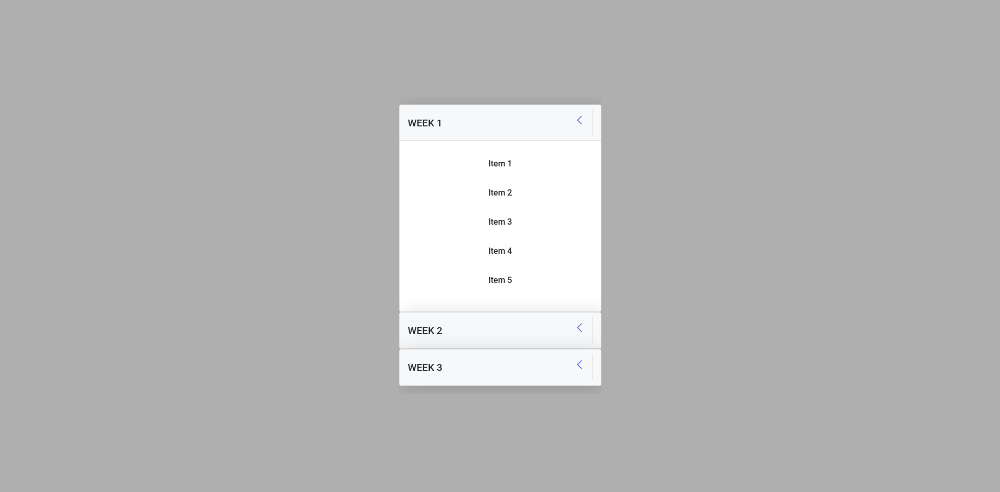

# Foxmula Internship Second Round

The repository contains the code files for the tasks assigned for the second round of the Foxmula Internship.

## Task 1

**Problem Assigned** : To create an effect on the title of the landing page on scroll so that it creates a parallax effect.

**Solution Implemented** : The parallax effect can be created on manipulating the `transformY` propery of the title element. This needs to be done on a scroll event so that this effect is observed on scroll.

**Drawbacks** : The parallax effect has a performance drawback as the parallax function is called on every scroll event.

**How this can be improved** : We can use a debounce function which calls the parallax function after every 100 or 200ms. However this leads to a not so smooth transition effect on scroll. Hence to maintain the task accuracy, it has not been included in the main code.

**Implementation of debounce function** :

```
function debounce(func, timeout = 10) {
  let timer;
  return (...args) => {
    clearTimeout(timer);
    timer = setTimeout(() => {
      func.apply(this, args);
    }, timeout);
  };
}
```

**Screenshots**


## Task 2

**Problem Assigned** : To create an accordion which contains list items.

**Solution Implemented** : The accordion has been created by using the Accordion component provided by Bootstrap and also modifying a few classes with CSS3 to make it look like the design.

**Screenshots**

